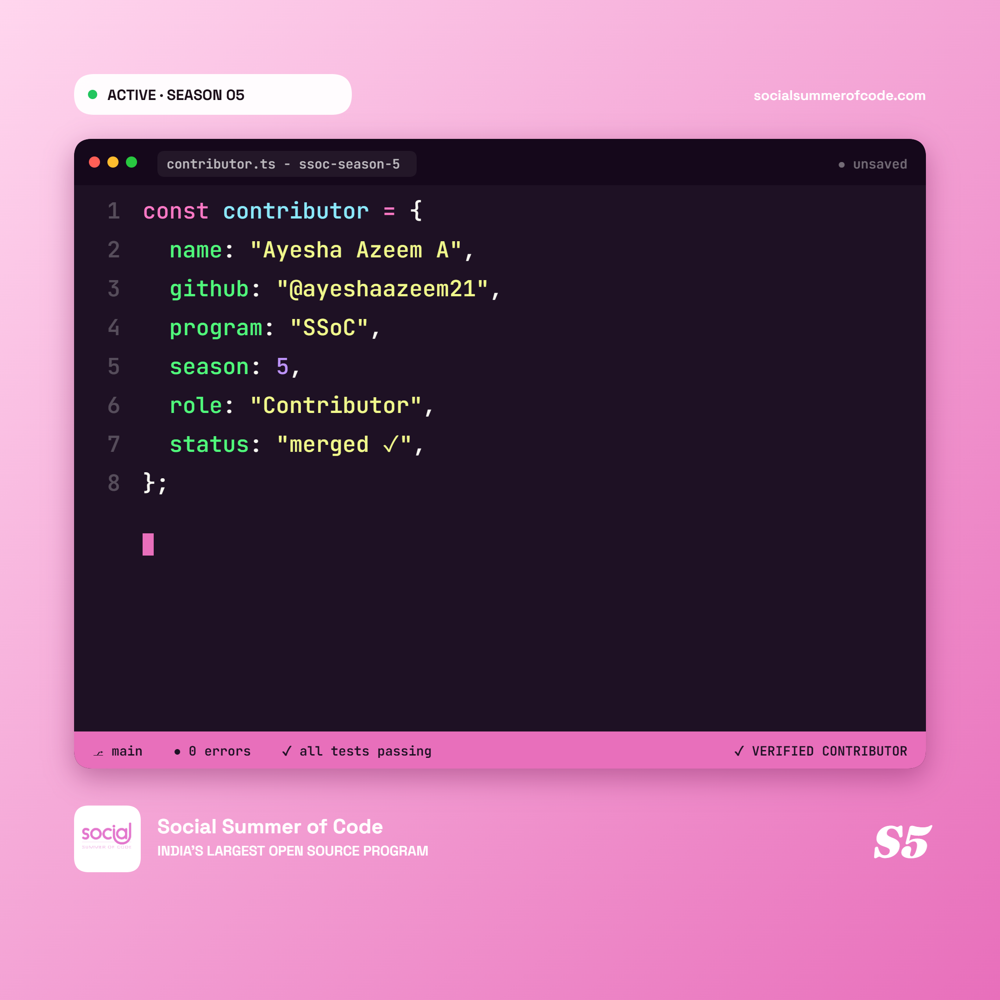

# Hi, I'm Ayesha Azeem 👋

B.Tech CSE student at KMEA Engineering College | Python enthusiast | AI/ML learner

## 🛠️ Skills
Python • Java • C • JavaScript • SQL

## 💼 Experience
- Python Dev Intern @ CodeClause
- AI & Prompt Engineering Intern @ VaultOfCodes

## 📜 Certifications
- IBM AI Developer
- NPTEL — Artificial Intelligence
- NASSCOM — Generative AI Literacy

## 🌐 Connect
[LinkedIn](https://www.linkedin.com/in/ayeshaazeem21/) • [Email](mailto:ayesha2006azeem@gmail.com)
